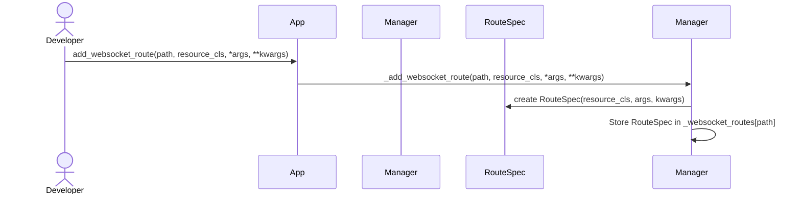
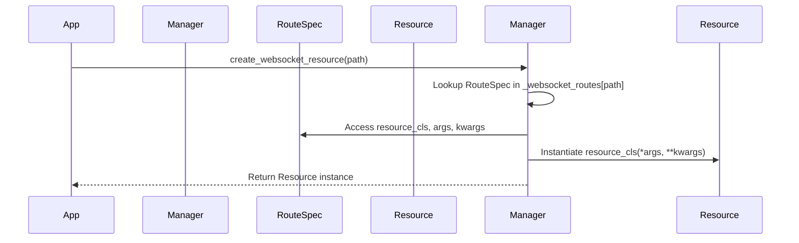
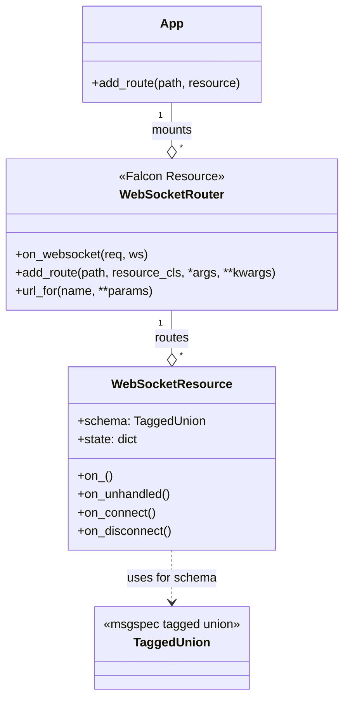
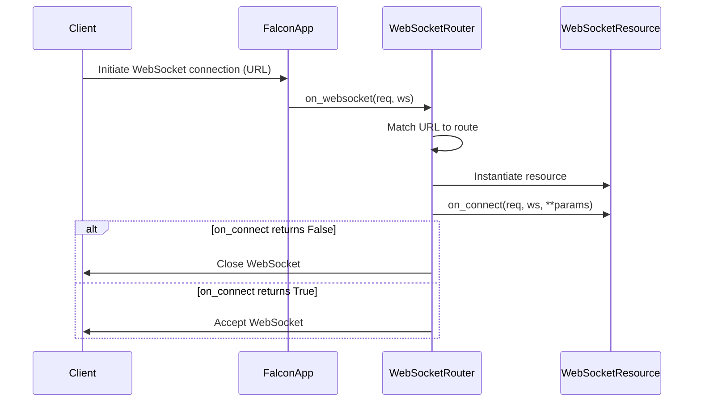
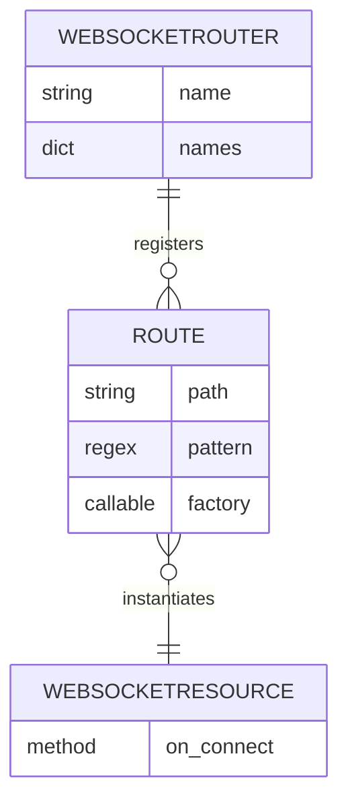
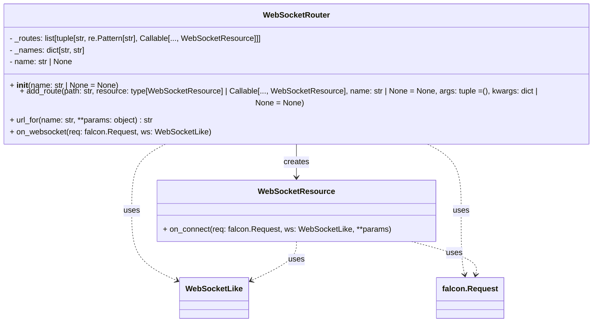
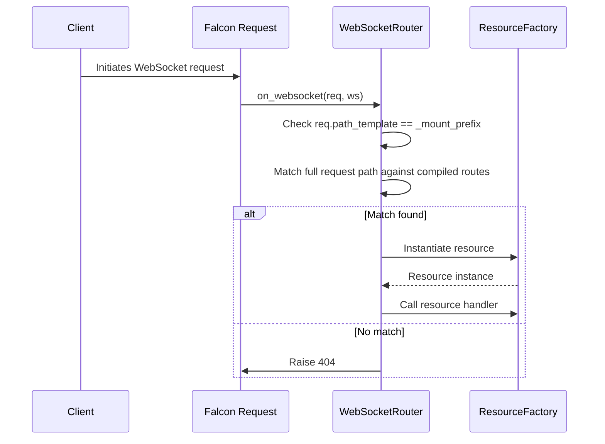
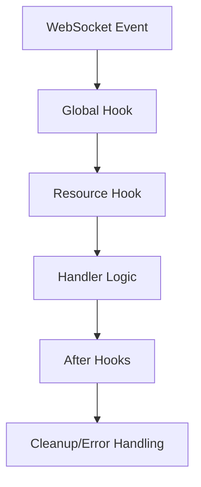
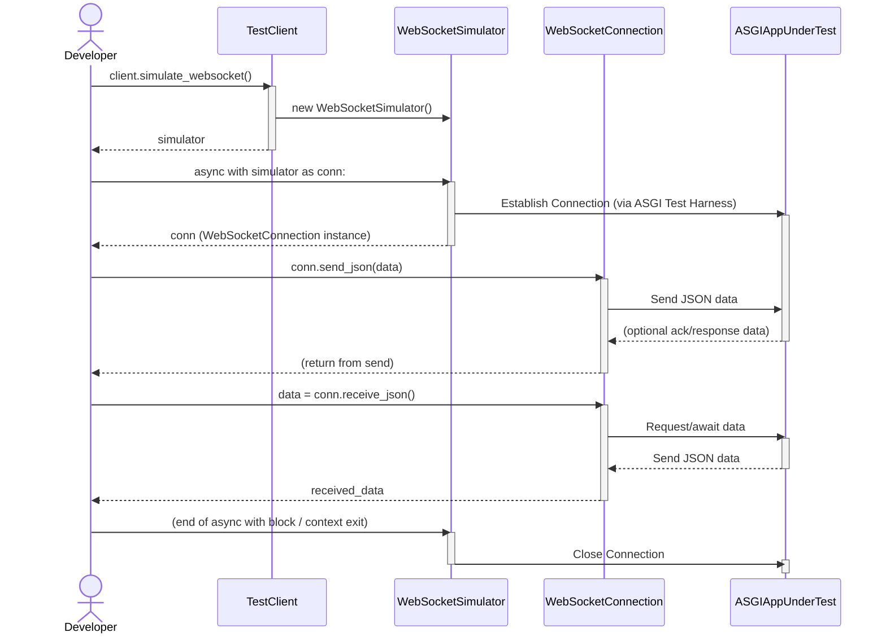

# Falcon-Pachinko: Asynchronous WebSocket Routing in Falcon

## 1. Introduction

The Falcon Web Framework is recognized for its performance, reliability, and
minimalist design, making it a popular choice for building RESTful APIs and web
application backends in Python.[^1] While Falcon provides foundational support
for WebSocket connections through its ASGI (Asynchronous Server Gateway
Interface) integration[^2], it currently lacks a higher-level abstraction for
routing and handling WebSocket messages in a manner analogous to its
well-regarded HTTP routing and request handling mechanisms. This limitation
often requires developers to implement custom dispatch logic within a single
WebSocket handler, which can become complex for applications with rich
real-time interaction.

This report presents a design proposal for an extension library, tentatively
named "Falcon-Pachinko," aimed at addressing this gap. The proposed library
will provide a structured and Falcon-idiomatic approach to routing WebSocket
messages based on their content (e.g., a 'type' field in a JSON payload) and
managing WebSocket connections. Furthermore, it will include a mechanism for
associating background workers (such as pollers or publish/subscribe event
handlers) with active WebSocket connections to facilitate server-initiated
updates to clients.

The design prioritizes leveraging Falcon's existing capabilities and adhering
to its core principles, particularly the principle of least surprise for
developers already familiar with Falcon's HTTP paradigm. The AsyncAPI document,
as specified in the use case, will be treated as a design artifact informing
the structure of messages and interactions, rather than being directly consumed
by the library at runtime. This document will first survey existing solutions
and identify the specific needs addressed by the proposed extension. It will
then detail the core components and API of Falcon-Pachinko, followed by an
illustrative use case. Finally, potential future enhancements and conclusions
will be discussed.

## 2. Literature Survey and Existing Solutions

Before detailing the proposed design, it is pertinent to survey existing
WebSocket handling mechanisms within Falcon and other relevant Python web
frameworks and libraries. This provides context and helps identify established
patterns and potential areas for improvement.

### 2.1. Falcon's Native WebSocket Capabilities

Falcon's support for WebSockets is built upon the ASGI WebSocket Specification
and is available in its ASGI applications.[^2] Developers can add WebSocket
support to a route by implementing an
`async def on_websocket(self, req, websocket)` responder method within a
resource class.[^1] This method is invoked when a WebSocket handshake request
is successfully routed.

The `falcon.asgi.WebSocket` object provided to this responder offers methods
for managing the connection lifecycle, such as `accept()`, `close()`,
`receive_text()`, `receive_data()`, `send_text()`, and `send_data()`. [^2]
Falcon also handles events like lost connections by raising a
`WebSocketDisconnected` exception. Middleware components and media handlers can
be used to augment WebSocket flows, similar to regular HTTP requests.[^2]

However, Falcon's native support routes an entire WebSocket connection to a
single `on_websocket` handler. For applications requiring dispatch based on
incoming message types (e.g., in a chat application with different commands
like 'send_message', 'user_typing', etc.), developers must implement this logic
manually within the `on_websocket` method. This can lead to large, complex
conditional structures that are difficult to maintain and test.

### 2.2. Starlette

Starlette, a lightweight ASGI framework, provides robust WebSocket support. It
uses `WebSocketRoute` for defining WebSocket endpoints, which can be an `async`
function or an ASGI class like `WebSocketEndpoint`.[^3] The `WebSocketEndpoint`
class typically offers methods like `on_connect`, `on_receive`, and
`on_disconnect` to handle different phases of the WebSocket lifecycle, although
the specifics of `WebSocketEndpoint` are not fully detailed in the reviewed
material.[^3] The `starlette.websockets.WebSocket` class itself provides
comprehensive methods for interaction, including `accept()`, `close()`, various
`send_*` and `receive_*` methods (for text, bytes, JSON), and iterators for
messages.[^4] Starlette's routing is path-based; message content-based dispatch
within an endpoint remains a manual task for the developer.

### 2.3. Django Channels

Django Channels extends Django to handle WebSockets and other protocols beyond
HTTP, built on ASGI.[^5] It introduces concepts like `Consumers` (analogous to
Django views but for WebSockets and other protocols) which handle the lifecycle
of a connection (e.g., `connect`, `disconnect`, `receive`).[^6] Routing is
managed by `ProtocolTypeRouter` (to distinguish between HTTP, WebSocket, etc.)
and `URLRouter` (for path-based routing to consumers).[^5] A key feature of
Channels is the "channel layer," an abstraction for inter-process communication
(often backed by Redis), allowing different parts of an application, including
background tasks, to send messages to WebSockets.[^5] While powerful, Django
Channels is a comprehensive system deeply integrated with Django, representing
a more heavyweight solution than what is typically sought for a Falcon
extension.

### 2.4. FastAPI

FastAPI, built on Starlette, leverages Starlette's WebSocket capabilities.[^7]
It provides a decorator, `@app.websocket("/ws")`, to define WebSocket
endpoints.[^7] Similar to Falcon and Starlette's basic function endpoints, this
decorator typically maps a path to a single asynchronous function that manages
the entire WebSocket connection lifecycle, including accepting the connection,
receiving messages in a loop, and sending responses.[^7] Message dispatch based
on content within this function is a manual implementation detail.

### 2.5. `websockets` Library

The `websockets` library is a focused Python library for building WebSocket
servers and clients, emphasizing correctness, simplicity, and performance.[^8]
It is built on `asyncio` and provides a coroutine-based API. While excellent
for implementing the WebSocket protocol itself (e.g., `serve` for servers,
`connect` for clients), it is not a web framework extension and does not offer
higher-level routing or integration with framework components like Falcon's
resources or request objects.[^8] Its primary goal is protocol implementation
rather than framework-level application structure.

### 2.6. Gap Analysis and Opportunity

The survey reveals that while Falcon has basic ASGI WebSocket support, it lacks
a dedicated mechanism for structured message routing and handling within a
WebSocket connection that is analogous to its HTTP request handling. Frameworks
like Django Channels offer very comprehensive solutions but come with
significant architectural overhead. Starlette and FastAPI provide clean
WebSocket endpoint definitions but still require manual message dispatch logic
within those endpoints.

This identifies a clear opportunity for a Falcon extension that:

1. Provides a routing mechanism for incoming WebSocket messages based on their
   content (e.g., a 'type' field).

2. Offers a class-based structure for WebSocket handlers, similar to Falcon's
   HTTP resources, promoting organization and reusability.

3. Integrates a system for managing active connections to allow background
   workers to easily send messages to specific clients or groups of clients.

4. Achieves this in a lightweight, Falcon-idiomatic manner, consistent with the
   framework's philosophy of minimalism and developer experience.

The proposed Falcon-Pachinko library aims to fill this gap.

## 3. Proposed Design for Falcon WebSocket Extension ("Falcon-Pachinko")

The design of the Falcon-Pachinko extension is guided by the core principles of
leveraging Falcon's existing strengths, maintaining consistency with its HTTP
API, adhering to the principle of least surprise for Falcon developers, and
ensuring the extension remains lightweight.

### 3.1. Core Principles

- **Leverage Falcon's ASGI Foundation**: The extension will build upon Falcon's
  existing `falcon.asgi.App` and `falcon.asgi.WebSocket` components[^1],
  ensuring seamless integration with the ASGI ecosystem.

- **Consistency with Falcon HTTP API**: The patterns for defining routes and
  resource handlers for WebSockets will closely mirror those used for HTTP,
  making the extension intuitive for existing Falcon users.

- **Principle of Least Surprise**: Developers familiar with Falcon should find
  the concepts and API of Falcon-Pachinko familiar and predictable.

- **Lightweight and Minimal Dependencies**: The core extension should introduce
  minimal overhead and dependencies, focusing on in-process functionality for
  common use cases.

### 3.2. Key Components

The extension will revolve around three primary components:

1. `WebSocketResource`: A base class that developers will inherit from to create
   WebSocket handlers. This class will provide lifecycle methods and a
   mechanism for dispatching incoming messages to specific handler methods.

2. **Message Dispatcher**: Integrated within the `WebSocketResource`, this
   mechanism will route incoming messages (assumed to be structured, e.g., JSON
   with a 'type' field) to appropriate asynchronous methods within the resource.

3. `WebSocketConnectionManager`: A central object responsible for tracking
   active WebSocket connections and managing logical groups or "rooms" of
   connections. This manager will be the primary interface for background
   workers to send messages to clients.

### 3.3. Application Integration

To enable the extension and its shared components, a simple setup step will be
required, typically during application initialization:

```python
import falcon.asgi
import falcon_pachinko  # The proposed extension library

app = falcon.asgi.App()
falcon_pachinko.install(app) # This would initialize and attach app.ws_connection_manager

```

This `install` function would instantiate the `WebSocketConnectionManager` and
make it accessible via the application instance (e.g.,
`app.ws_connection_manager`), allowing other parts of the application,
including background workers, to access it.

### 3.4. Routing WebSocket Connections

Analogous to Falcon's HTTP routing (`app.add_route()`), the extension
originally provided `app.add_websocket_route()` to associate a URL path with a
`WebSocketResource`.

> **Deprecated**: Use :meth:`falcon_pachinko.router.WebSocketRouter.add_route`
> instead.

```python
app.add_websocket_route(
    '/ws/chat/{room_name}',
    ChatRoomResource,
    history_size=100,
)

```

When a WebSocket upgrade request matches this path, Falcon-Pachinko will
instantiate `ChatRoomResource` with the provided arguments and manage the
connection lifecycle. Path parameters like `{room_name}` are supplied to the
resource's `on_*` methods, while options such as `history_size` are applied
during construction.



#### 3.4.1. Programmatic Resource Instantiation

Application code can also create a resource instance directly using
`app.create_websocket_resource(path)`. This helper returns a new object of the
class registered for `path` or raises `ValueError` if no such route exists.

> **Deprecated**: A :class:`WebSocketRouter` and its `add_route` API should be
> used to instantiate resources.

```python
chat_resource = app.create_websocket_resource('/ws/chat/{room_name}')

```

Each call yields a fresh instance so that connection-specific state can be
maintained independently.



### 3.5. The `WebSocketResource` Class

The `WebSocketResource` class is central to handling WebSocket interactions.
Developers will subclass it to implement their application-specific WebSocket
logic.

- **Lifecycle Methods**:

  - `async def on_connect(self, req, ws, **params) -> bool`: WebSocket
    connection is established and routed to this resource. `req` is the
    standard Falcon `Request` object associated with the initial HTTP upgrade
    request, and `ws` is a `WebSocketLike` **connection**. The protocol defines
    the minimal `send_media`, `accept`, and `close` methods needed by the
    resource. `params` will contain any path parameters from the route. It
    returns `True` to accept the connection or `False` to reject it. If `False`
    is returned, the library will handle sending an appropriate closing
    handshake (e.g., HTTP 403 or a custom code if supported by an extension
    like WebSocket Denial Response 12). This boolean return abstracts the
    direct `await ws.accept()` or `await ws.close()` call, simplifying the
    resource method to focus on connection logic rather than raw ASGI
    mechanics. This design aligns with Falcon's higher-level approach for HTTP
    handlers, where the framework manages response sending.

  - `async def on_disconnect(self, ws: WebSocketLike, close_code: int)`: Called
    when the WebSocket connection is closed, either by the client or the
    server. `close_code` provides the WebSocket close code.

  - `async def on_unhandled(self, ws: WebSocketLike, message: Union[str,
    bytes])`
    :
    A fallback handler for messages that are not dispatched by the more
    specific message handlers. This can be used for raw text/binary data or
    messages that don't conform to the expected structured format.

- State Management:

  By default, an instance of a WebSocketResource is created per connection,
  allowing self to hold connection-specific state. However, for applications
  with very high connection counts (e.g., 10k+ sockets), attaching significant
  state to each instance can lead to high memory consumption. To mitigate this,
  the resource's self.state attribute will be a swappable, dictionary-like
  proxy. Developers can replace it with a proxy to an external session store
  (e.g., a Redis hash or an in-memory LRU cache) to manage state efficiently at
  scale. The property lazily creates a plain ``dict`` but can be reassigned to
  a thread-safe mapping backed by Redis or another store when operating at high
  concurrency.

### 3.6. Message Handling and Dispatch

A key feature of Falcon-Pachinko is its ability to dispatch incoming WebSocket
messages to specific handler methods within the `WebSocketResource`. This
avoids a monolithic receive loop with extensive conditional logic.

- **Message Format Assumption**: The dispatch mechanism assumes messages are
  JSON objects containing a 'type' field that acts as a discriminator, for
  example: `{"type": "userTyping", "payload": {"isTyping": true}}`.

- **Dispatch Mechanisms**: Two equivalent mechanisms are provided for
  registering message handlers. The `@handles_message` decorator is the
  canonical, recommended approach as it is explicit and robust. The naming
  convention is offered as a best-effort convenience.

  1. **By Decorator (Canonical)**: For explicit and robust registration, the
     `@handles_message` decorator should be used. This is the preferred method
     as it is not subject to potential ambiguities with non-standard tag names.

  2. **By Convention (Convenience)**: As a convenience, a handler can be defined
     by creating a method named `on_{type_discriminator}`. The framework will
     attempt to convert `CamelCase` and `grazingCamelCase` discriminators to
     `snake_case` to form the method name (e.g., a message with
     `"type": "userTyping"` would be dispatched to `on_user_typing`). This is
     less robust for non-ASCII or complex (e.g., dotted) tags.

  ```python
  from falcon_pachinko import WebSocketLike, WebSocketResource, handles_message
  import msgspec as ms

  class NewChatMessage(ms.Struct):
      text: str

  class ChatMessageHandler(WebSocketResource):
      # Dispatched explicitly by decorator (canonical approach)
      @handles_message("new-chat-message")
      async def on_new_chat_message(
          self, ws: WebSocketLike, payload: NewChatMessage
      ) -> None:
          print(f"NEW MESSAGE: {payload.text}")


  ```

- **Automatic Deserialization and Strictness**: For routed messages where the
  handler's `payload` parameter is type-annotated with a `msgspec.Struct`, the
  library will perform high-performance validation and deserialization. By
  default, `msgspec` forbids extra fields in the payload. This strictness is a
  feature for ensuring contract adherence. Falcon-Pachinko exposes a ``strict``
  option on ``@handles_message`` to relax this behaviour when needed:

  ```python
  @handles_message("type", strict=False)
  async def on_type(self, ws, payload: SomeStruct) -> None:
      ...
  ```

#### 3.6.1. Descriptor Implementation of `handles_message`

The decorator is implemented as a descriptor so that handlers are registered
when their containing class is created:

```python
import functools
from types import MappingProxyType
import typing as typ


class _MessageHandlerDescriptor:
    """Store the original function and remember its owner class."""

    def __init__(self, msg_type: str, func: typ.Callable) -> None:
        self.msg_type = msg_type
        self.func = func
        functools.update_wrapper(self, func)
        self.owner = None
        self.name = None

    def __set_name__(self, owner: type, name: str) -> None:
        self.owner = owner
        self.name = name

        parent_registry = getattr(owner, "_message_handlers", {})
        # Each class must get its own registry; otherwise subclasses would
        # mutate the parent's handler map and cause cross-talk across the
        # hierarchy.
        registry: dict[str, typ.Callable] = dict(parent_registry)
        if self.msg_type in registry:
            raise RuntimeError(
                f"Duplicate handler for message type {self.msg_type!r} on {owner.__qualname__}"
            )
        registry[self.msg_type] = self.func
        owner._message_handlers = registry
        # Freeze the parent registry to guard against accidental mutation.
        base = owner.__bases__[0]
        if hasattr(base, "_message_handlers"):
            base._message_handlers = MappingProxyType(parent_registry)

    def __get__(self, instance: typ.Any, owner: type | None = None) -> typ.Callable:
        return self.func.__get__(instance, owner or self.owner)


def handles_message(msg_type: str) -> typ.Callable[[typ.Callable], _MessageHandlerDescriptor]:
    """Decorator factory returning the descriptor wrapper."""

    def decorator(func: typ.Callable) -> _MessageHandlerDescriptor:
        return _MessageHandlerDescriptor(msg_type, func)

    return decorator

```

### 3.7. `WebSocketConnectionManager`

The `WebSocketConnectionManager` is crucial for enabling server-initiated
messages and managing groups of connections. It will be built upon a pluggable
backend interface to support both single-process and distributed deployments.

- **API Design**:

  - **Awaitable Operations**: All methods that perform I/O (e.g.,
    `broadcast_to_room`, `send_to_connection`) will be coroutines (`async def`)
    and will propagate exceptions. This ensures that network failures or
    backend errors are not silent.

  - **Bounded Broadcasts**: `broadcast_to_room` accepts an optional per-send
    timeout to mitigate slow recipients.

  - **Async Iterators**: For bulk operations, the manager will expose async
    iterators, making them highly composable.

    ```python
    async for ws in conn_mgr.connections(room='general'):
        await ws.send_media(...)


    ```

- Pluggable Backends for Multi-Worker Support:

  The manager will be designed with a clear Abstract Base Class (ABC) defining
  its interface. The initial 1.0 release will ship with a default
  InProcessBackend suitable for single-worker deployments. However, the
  architecture is explicitly designed to support distributed systems in the
  future. A developer could implement a RedisBackend using Redis Pub/Sub to
  enable broadcasting across multiple server processes. This provides a clear
  and robust path to scalability without changing the application-level code
  that interacts with the connection manager.

### 3.8. Background Worker Integration via ASGI Lifespan

To manage long-running background tasks, this design eschews a bespoke registry
in favour of the standard ASGI lifespan protocol. This approach ensures that
workers are managed correctly by the ASGI server, provides fault transparency,
and simplifies the application's mental model.

#### 3.8.1. Design Objectives

1. **ASGI-Native Lifecycle**: Workers start after the application's `startup`
   event and are cancelled automatically during `shutdown`, as the ASGI
   specification intends.

2. **Explicit Wiring**: The application explicitly defines which workers to run
   and injects any dependencies directly, removing "magic" or hidden state.

3. **Fault Transparency**: An unhandled exception in a worker will crash the
   server process immediately, ensuring failures are not silent. Developers can
   opt-in to supervision for tasks that should be restarted.

4. **Framework Agnosticism**: The pattern works with any ASGI-compliant server
   (e.g., Uvicorn, Hypercorn) and in both synchronous and asynchronous Falcon
   applications.

5. **Zero Global State**: The design avoids singletons, ensuring multiple Falcon
   applications can run in the same process without interference.

#### 3.8.2. Public API: The `WorkerController`

A new module, `pachinko.workers`, will provide the core components for this
feature.

```python
# pachinko/workers.py (new module)
import asyncio
from contextlib import AsyncExitStack
import collections.abc as cabc
import typing as typ

WorkerFn: typ.TypeAlias = cabc.Callable[[typ.Any], cabc.Awaitable[None]]


class WorkerController:
    """Manages a set of long-running asyncio tasks tied to an ASGI lifespan."""
    __slots__: typ.Final = ("_tasks", "_stack")

    def __init__(self) -> None:
        self._tasks: list[asyncio.Task[None]] = []
        self._stack: AsyncExitStack | None = None

    async def start(self, *workers: WorkerFn, **context: typ.Any) -> None:
        """Create and supervise tasks. *context is injected into each worker."""
        self._stack = AsyncExitStack()
        await self._stack.__aenter__()

        for fn in workers:
            task = asyncio.create_task(fn(**context))
            self._tasks.append(task)

    async def stop(self) -> None:
        """Cancel tasks and propagate first exception, if any."""
        for t in self._tasks:
            t.cancel()
        await asyncio.gather(*self._tasks, return_exceptions=True)
        if self._stack:
            await self._stack.__aexit__(None, None, None)

# Optional syntactic sugar
def worker(fn: WorkerFn) -> WorkerFn:
    """Marks *fn* as a valid worker. Purely cosmetic but documents intent."""
    fn.__pachinko_worker__ = True
    return fn

```

#### 3.8.3. Application Usage

Developers will instantiate the `WorkerController` and use Falcon's
`@app.lifespan` context manager (available since Falcon 4.0) to manage the
worker lifecycle.

```python
# app.py
import falcon.asgi
import pachinko
from pachinko.workers import WorkerController, worker

# Assume conn_mgr is created via falcon_pachinko.install(app)
# and is available as app.ws_connection_manager
app = falcon.asgi.App()
pachinko.install(app)
conn_mgr = app.ws_connection_manager

# 1. Define workers as ordinary async functions with explicit dependencies
@worker
async def announcement_worker(conn_mgr: pachinko.WebSocketConnectionManager) -> None:
    """Broadcasts a heartbeat message to all sockets every 30s."""
    while True:
        await conn_mgr.broadcast_to_all({"type": "ping"}) # Assuming a broadcast_to_all method
        await asyncio.sleep(30)

# 2. Bind the worker lifecycle to the ASGI lifespan
controller = WorkerController()

@app.lifespan
async def lifespan(app_instance):
    # Start workers, injecting dependencies as keyword arguments
    await controller.start(
        announcement_worker,
        conn_mgr=conn_mgr,
    )
    yield
    # --- app is live ---
    await controller.stop()

```

This pattern eliminates the need for a bespoke worker registry, making the
entire process explicit and testable. Unhandled exceptions in
`announcement_worker` will propagate and terminate the server, preventing
silent failures.

### 3.9. API Overview

The following table summarizes the key components of the proposed
Falcon-Pachinko API and their analogies to Falcon's HTTP mechanisms, where
applicable. This serves as a quick reference to understand the main
abstractions and their intended use. This API structure is designed to be both
powerful enough for complex applications and intuitive for developers
accustomed to Falcon.

| Component                      | Key Elements                                                  | Purpose                                                                 | Falcon Analogy              |
| ------------------------------ | ------------------------------------------------------------- | ----------------------------------------------------------------------- | --------------------------- |
| Application Setup              | `falcon_pachinko.install(app)`                                | Initializes shared WebSocket components such as the connection manager. | App-level extensions        |
| Route Definition               | `app.add_websocket_route()` and `WebSocketRouter.add_route()` | Maps a URI path to a `WebSocketResource`.                               | `app.add_route()`           |
| Resource Class                 | `falcon_pachinko.WebSocketResource`                           | Handles connections and messages for a given route.                     | Falcon HTTP `Resource`      |
| Connection Lifecycle           | `on_connect()`, `on_disconnect()`                             | Setup and teardown hooks for each connection.                           | Request/response middleware |
| Message Handling (Typed)       | `@handles_message()` and `on_{type}`                          | Routes incoming JSON messages by type.                                  | `on_get`, `on_post`, etc.   |
| Message Handling (Generic)     | `on_unhandled()`                                              | Fallback for unrecognized or non-JSON messages.                         | N/A                         |
| Background Worker Integration  | `WorkerController`, `@app.lifespan`                           | Manages long-running tasks within the ASGI lifecycle.                   | Custom patterns             |
| Connection Management (Global) | `app.ws_connection_manager`                                   | Tracks connections and enables broadcasting.                            | N/A                         |

## 4. Illustrative Usecase: Real-time Chat Application

To demonstrate the practical application and ergonomics of the proposed
Falcon-Pachinko extension, this section outlines its use in building a
real-time chat application.

### 4.1. Scenario Overview

The chat application will support multiple chat rooms. Users can connect to a
specific room via a WebSocket URL (e.g., `/ws/chat/{room_name}`). Once
connected, they can send messages, and these messages will be broadcast to all
other users in the same room. The application will also support presence
indications (users joining/leaving) and typing indicators.

An AsyncAPI document (used as a design artifact) would define the message
structures. For example:

- Client to Server:

  - `{"type": "clientSendMessage", "payload": {"text": "Hello everyone!"}}`

  - `{"type": "clientStartTyping"}`

  - `{"type": "clientStopTyping"}`

- Server to Client:

  - `{"type": "serverNewMessage", "payload": {"user": "Alice", "text": "Hello
    everyone!"}}`

  - `{"type": "serverUserJoined", "payload": {"user": "Bob"}}`

  - `{"type": "serverUserLeft", "payload": {"user": "Alice"}}`

  - `{"type": "serverUserTyping", "payload": {"user": "Charlie", "isTyping":
    true}}`

### 4.2. Defining the Chat WebSocket Resource

A `ChatRoomResource` class would be defined, inheriting from
`falcon_pachinko.WebSocketResource`:

```python
import falcon.asgi
from falcon_pachinko import WebSocketLike, WebSocketResource, handles_message

class ChatRoomResource(WebSocketResource):
    async def on_connect(self, req: falcon.Request, ws: WebSocketLike, room_name: str) -> bool:
        # Assume authentication middleware has set req.context.user
        self.user = req.context.get("user")
        if not self.user:
            return False # Reject connection

        self.room_name = room_name
        
        await self.join_room(self.room_name)

        await ws.send_media({
            "type": "serverSystemMessage",
            "payload": {"text": f"Welcome {self.user.name} to room '{room_name}'!"}
        })

        await self.broadcast_to_room(
            self.room_name,
            {"type": "serverUserJoined", "payload": {"user": self.user.name}},
            exclude_self=True
        )
        return True

    @handles_message("clientSendMessage")
    async def handle_send_message(self, ws: WebSocketLike, payload: dict):
        message_text = payload.get("text", "")
        # Add validation/sanitization as needed
        await self.broadcast_to_room(
            self.room_name,
            {"type": "serverNewMessage", "payload": {"user": self.user.name, "text": message_text}}
        )

    @handles_message("clientStartTyping")
    async def handle_start_typing(self, ws: WebSocketLike, payload: dict):
        await self.broadcast_to_room(
            self.room_name,
            {"type": "serverUserTyping", "payload": {"user": self.user.name, "isTyping": True}},
            exclude_self=True
        )

    @handles_message("clientStopTyping")
    async def handle_stop_typing(self, ws: WebSocketLike, payload: dict):
        await self.broadcast_to_room(
            self.room_name,
            {"type": "serverUserTyping", "payload": {"user": self.user.name, "isTyping": False}},
            exclude_self=True
        )

    async def on_disconnect(self, ws: WebSocketLike, close_code: int):
        if hasattr(self, 'room_name') and hasattr(self, 'user'):
            await self.broadcast_to_room(
                self.room_name,
                {"type": "serverUserLeft", "payload": {"user": self.user.name}},
                exclude_self=True 
            )
            await self.leave_room(self.room_name)
        print(
            f"User {getattr(self.user, 'name', 'Unknown')} disconnected from room"
            f" {getattr(self, 'room_name', 'N/A')} with code {close_code}"
        )

    async def on_unhandled(self, ws: WebSocketLike, message: Union[str, bytes]):
        # Fallback for messages not matching handled types or non-JSON
        print(f"Received unhandled message from {self.user.name} in {self.room_name}: {message}")
        await ws.send_media({
            "type": "serverError",
            "payload": {"error": "Unrecognized message format or type."}
        })

```

This example demonstrates how the `WebSocketResource` streamlines the
development of a feature-rich chat application. The abstractions for room
management and typed message handling significantly reduce boilerplate code.

### 4.3. Routing and Application Setup

In the main application file:

```python
import falcon.asgi
import falcon_pachinko
import asyncio
from falcon_pachinko.workers import WorkerController

# Assuming ChatRoomResource is defined as above
# Assuming an authentication middleware `AuthMiddleware` that sets `req.context.user`

app = falcon.asgi.App(middleware=[AuthMiddleware()])
falcon_pachinko.install(app)
conn_mgr = app.ws_connection_manager

# Add the WebSocket route
app.add_websocket_route('/ws/chat/{room_name}', ChatRoomResource)

# Define a background worker
async def system_announcement_worker(conn_mgr: falcon_pachinko.WebSocketConnectionManager) -> None:
    while True:
        await asyncio.sleep(3600) # Every hour
        announcement_text = "System maintenance is scheduled for 2 AM UTC."
        chat_room_ids = await conn_mgr.get_rooms_by_prefix("chat_")
        for room_id in chat_room_ids:
            await conn_mgr.broadcast_to_room(
                room_id,
                {"type": "serverSystemAnnouncement", "payload": {"text": announcement_text}}
            )

# Manage the worker with the ASGI lifespan
controller = WorkerController()
@app.lifespan
async def lifespan(app_instance):
    await controller.start(system_announcement_worker, conn_mgr=conn_mgr)
    yield
    await controller.stop()

```

### 4.4. Client-Side Interaction (Conceptual)

A JavaScript client would interact as follows:

1. **Connect**:
   `const socket = new WebSocket("ws://localhost:8000/ws/chat/general");`

2. **Send Messages**:

   ```javascript
   socket.send(JSON.stringify({type: "clientSendMessage", payload: {text: "Hi there!"}}));
   socket.send(JSON.stringify({type: "clientStartTyping"}));


   ```

3. **Receive Messages**:

   ```javascript
   socket.onmessage = function(event) {
       const message = JSON.parse(event.data);
       switch(message.type) {
           case "serverNewMessage":
               // Display message.payload.user and message.payload.text
               break;
           case "serverUserJoined":
               // Update user list with message.payload.user
               break;
           // Handle other message types...
       }
   };


   ```

This illustrative use case shows how Falcon-Pachinko can provide a
comprehensive and developer-friendly solution for building real-time
applications on Falcon.

## 5. Advanced Proposal: Composable and Schema-Driven WebSocket Routing

Building upon the foundational concepts outlined above, this section details a
more advanced, composable architecture for WebSocket handling. This evolved
design introduces a dedicated `WebSocketRouter`, support for nested resources,
and a high-performance, schema-driven message dispatch mechanism. Its primary
goal is to achieve true ergonomic parity with Falcon's acclaimed HTTP routing
while enabling highly structured, maintainable, and performant real-time
applications.

The following diagram provides a high-level overview of the main classes and
their relationships within this advanced proposal.



### 5.1. The `WebSocketRouter` as a Composable Falcon Resource

To provide a cleaner separation of concerns and a more powerful, composable
API, this proposal treats the `WebSocketRouter` as a standard Falcon resource.
This allows routers to be mounted on the main application, enabling the
creation of modular, hierarchical WebSocket APIs.

#### 5.1.1. Mounting the Router

Instead of assigning a router to a special application attribute, it is mounted
at a URL prefix using Falcon's standard `app.add_route()` method. This makes
the `WebSocketRouter` a first-class citizen in Falcon's routing tree.

```python
import falcon.asgi
from falcon_pachinko.router import WebSocketRouter # New component

app = falcon.asgi.App()
chat_router = WebSocketRouter()

# The WebSocketRouter instance is mounted like any other Falcon resource.
# It will handle all WebSocket connections under the '/ws/chat/' prefix.
app.add_route('/ws/chat', chat_router)

# To achieve this, the WebSocketRouter will implement the on_websocket
# responder method, which will contain the logic to dispatch the connection
# to the correct sub-route defined on the router itself.

```

This creates a clean architectural boundary and leverages Falcon's existing,
well-understood routing mechanism for composition.

#### 5.1.2. `add_route` API, Factories, and URL Reversal

The `WebSocketRouter` features its own `add_route()` method for defining
sub-routes. These paths are *relative* to the router's mount point.

- **Resource Factories**: To mirror Falcon's flexibility, `add_route` will
  accept not only `WebSocketResource` subclasses but also **callable
  factories**. A factory is any callable that accepts the same arguments as a
  resource's constructor and returns a resource instance. This keeps the
  barrier to entry low for simple, functional use cases.

- **Resource Initialization**: The method accepts `*args` and `**kwargs` to be
  passed to the resource's constructor (or factory), allowing for
  route-specific configuration.

- **URL Reversal**: To discourage hard-coding paths, the router will provide a
  `url_for(name, **params)` helper to generate URLs for its routes, similar to
  other modern web frameworks.

```python
# Continuing the previous example:
chat_router = WebSocketRouter(name='chat') # Give the router a name for reversal

# Add a route to the router, giving it a name for url_for.
chat_router.add_route(
    '/{room_id}', 
    ChatResource,
    name='room',
    init_args={'history_size': 100}
)

app.add_route('/ws/chat', chat_router)

# Generate a URL:
# url = app.url_for('chat:room', room_id='general') # Hypothetical top-level reversal
# -> '/ws/chat/general'

```

The router is responsible for matching the incoming connection URI against its
registered routes, parsing any path parameters (like `{room_id}`),
instantiating the correct `WebSocketResource` with its specific initialization
arguments, and handing off control of the connection.

#### 5.1.3. Router Flow and Structure

The diagrams below illustrate the flow of a WebSocket connection through the
router and the relationships between the main classes.





<!-- markdownlint-disable MD013 -->



<!-- markdownlint-enable MD013 -->

### 5.2. Composable Architecture: Nested Resources

To facilitate the creation of modular and hierarchical applications, this
design introduces the concept of nested resources via an `add_subroute` method
on a resource instance. This allows developers to organize complex, related
functionality into distinct, reusable classes.

#### 5.2.1. The `add_subroute` Mechanism

A parent resource can mount a sub-resource at a relative path, promoting a
logical code hierarchy.

```python
# --- In project_resource.py ---
class ProjectResource(WebSocketResource):
    def __init__(self, req, ws, project_id: str):
        super().__init__(req, ws)
        # ... project-specific setup using project_id ...

        # Mount sub-resources
        self.add_subroute('tasks', TasksResource)
        self.add_subroute('files', FilesResource)

# --- In the main application ---
# This assumes a router is already defined.
router.add_route('/projects/{project_id}', ProjectResource)

# A connection to "ws://.../projects/123/tasks" would be handled
# by an instance of TasksResource, with the context of project "123".

```

#### 5.2.2. Path Composition and State Management

The `WebSocketRouter` must resolve these composite paths. A trie (prefix tree)
is the natural data structure for this task. When resolving a path like
`/projects/123/tasks`, the router would first match `/projects/{project_id}`
and instantiate `ProjectResource`, passing it the `project_id`. The
`ProjectResource` constructor would then call `add_subroute`, registering
`TasksResource`. The router would then match the `tasks` segment and
instantiate `TasksResource`.

A critical aspect is **context passing**. The router must facilitate passing
state from parent to child. A robust implementation would involve the router
instantiating the entire resource chain, allowing parent resources to pass
relevant state (or `self`) into the constructors of their children.



#### 5.2.3. Context-Passing for Nested Resources

Explicit context handoff keeps nested resources predictable and mirrors
Falcon's philosophy of avoiding hidden state. Each parent resource controls
what data flows to its children, allowing shared state without resorting to
globals.

1. **Per-resource context provider**

   Add an overridable `get_child_context()` method to `WebSocketResource`. The
   router calls this hook after instantiating the parent to obtain keyword
   arguments for the next child. The default implementation returns `{}`, so
   resources opt in to sharing.

   ```python
   def get_child_context(self) -> dict[str, object]:
       """Return kwargs to be forwarded to the immediate child resource."""
       return {}
   ```

   A concrete signature signals that callers can rely on a plain dict and keeps
   the hook symmetric with Falcon's HTTP-style `get_child_scope()` patterns.

2. **Shared state object**

   Pass the same connection-scoped `state` proxy down the chain. The router
   sets `child.state = parent.state` unless the parent supplies an alternative
   via `get_child_context()`.

3. **Router chain instantiation**

   For each path segment the router will:

   - Instantiate the parent with path parameters and static init args.
   - Invoke `get_child_context()` to obtain context for the child.
   - Instantiate the child, merging path params with the context
     kwargs.
   - Propagate the shared `state` proxy.

4. **Convenience API**

   `add_subroute()` records the child factory along with any static
   positional/keyword args and retains a reference to the parent. This enables
   the router to look up subroutes while composing the resource chain.

5. **Testing and docs**

   Provide examples where a parent loads a `project` object and injects it into
   `TasksResource`, verifying that the child receives the object and both
   modify the shared `state`.

   The relationships and runtime behavior are illustrated below.

   ```mermaid
   classDiagram
       class WebSocketResource {
           +get_child_context() kwargs
           state
       }
       class WebSocketRouter {
           +instantiate_resource_chain(path_segments, path_params, static_args)
           +add_subroute(child_factory, *args, **kwargs)
       }
       WebSocketResource <|-- ParentResource
       WebSocketResource <|-- ChildResource
       WebSocketRouter o-- WebSocketResource : instantiates
       ParentResource o-- ChildResource : add_subroute
       ParentResource --> ChildResource : get_child_context()
       ParentResource --> ChildResource : state (shared)
   ```

   ```mermaid
   sequenceDiagram
       participant Router as WebSocketRouter
       participant Parent as ParentResource
       participant Child as ChildResource
       Router->>Parent: Instantiate with path params, static args
       Router->>Parent: get_child_context()
       Parent-->>Router: context kwargs
       Router->>Child: Instantiate with path params + context kwargs
       Router->>Child: Set child.state = parent.state (unless overridden)
   ```

### 5.3. High-Performance Schema-Driven Dispatch with `msgspec`

This proposal elevates the dispatch mechanism using `msgspec` and its support
for tagged unions. This moves from simple dispatch to a declarative,
schema-driven approach.

#### 5.3.1. Declaring Message Schemas

A resource defines its message schema using a `typ.Union` of `ms.Struct` types,
where each `Struct` represents a distinct message.

```python
import msgspec as ms
import typing as typ

# Define individual message structures
class Join(ms.Struct, tag='join'):
    room: str

class SendMessage(ms.Struct, tag='sendMessage'): # Note CamelCase tag
    text: str

# Create a tagged union of all possible messages
MessageUnion = typ.Union[Join, SendMessage]

class ChatResource(WebSocketResource):
    # Associate the schema with the resource
    schema = MessageUnion
    
    # Handler by decorator (canonical) for tag='join'
    @handles_message('join')
    async def on_join(self, req, ws, msg: Join):
        print(f"Joining room: {msg.room}")
    
    # Handler by convention (convenience) for tag='sendMessage'
    # The framework converts 'sendMessage' to 'on_send_message'
    async def on_send_message(self, req, ws, msg: SendMessage):
        print(f"Message received: {msg.text}")

```

#### 5.3.2. Automated Dispatch Logic

The base `WebSocketResource` would contain a receive loop that performs the
following steps:

1. Receive a raw message from the WebSocket.

2. Decode the message using `msgspec.json.decode(message, type=self.schema)`.
   `msgspec`'s tagged union support automatically inspects a tag field in the
   JSON to select the correct `Struct` for decoding.

3. Inspect the `tag` of the resulting `Struct` instance.

4. Find a handler registered with `@handles_message` for that tag. If not found,
   attempt to find a handler by the `on_{tag}` naming convention.

5. Dynamically invoke the handler, e.g.,
   `await self.on_send_message(req, ws, msg)`.

This schema-driven design completely eliminates boilerplate dispatch logic and
provides "zero-cost" validation via `msgspec`.

#### 5.3.3. Error Handling

The framework must gracefully handle dispatch errors.

- A `msgspec.ValidationError` raised during decoding should be caught, and a
  customisable error hook should be invoked.

- If a message has a valid tag that does not correspond to any registered
  handler, the `on_unhandled(self, req, ws, msg)` fallback method on the base
  resource should be called.

### 5.4. A Multi-Tiered Middleware and Hook System

To handle cross-cutting concerns like authentication, logging, and metrics, a
flexible, multi-layered hook system is proposed.

#### 5.4.1. Global and Per-Resource Hooks

- **Global Hooks:** Registered on the `WebSocketRouter` (`router.global_hooks`),
  these apply to every connection handled by that router. They are ideal for
  universal concerns like authentication or establishing database connections.

- **Per-Resource Hooks:** Registered on a `WebSocketResource` class
  (`resource.hooks`), these apply only to that resource and any of its
  sub-resources. This allows for specific logic, such as permissions checks for
  a particular channel.

#### 5.4.2. Lifecycle Events and Execution Order

The hooks correspond to the WebSocket lifecycle: `before_connect`,
`after_connect`, `before_receive`, `after_receive`, and `before_disconnect`.
The execution order follows a layered, "onion-style" model for any given event,
as illustrated below.



The specific sequence is as follows:

1. Global `before_*` hook(s)

2. Parent Resource `before_*` hook(s) (if nested)

3. Resource-specific `before_*` hook(s)

4. The core handler logic (e.g., `on_connect` or an `on_<tag>` message handler)

5. Resource-specific `after_*` hook(s)

6. Parent Resource `after_*` hook(s) (if nested)

7. Global `after_*` hook(s)

This provides maximum control, allowing outer layers to act as setup/teardown
guards for inner layers. An exception in a `before_*` hook should terminate the
connection attempt immediately.

### 5.5. Architectural Implications

#### 5.5.1. Stateful Per-Connection Resources and Dependency Injection

This design solidifies the paradigm of a **stateful, per-connection resource
instance**, a shift from Falcon's traditional stateless HTTP model. The
resource instance itself becomes the container for connection-specific state.
This raises a critical architectural question: how do these ephemeral resource
instances get access to long-lived, shared services (like database connection
pools)?

A formal **dependency injection (DI)** strategy is therefore a necessary
component of this proposal. This could be achieved by allowing a DI container
or a resource factory to be passed to the `WebSocketRouter`, which would then
be responsible for injecting dependencies into resource constructors.

#### 5.5.2. Enabling a "Schema-First" Workflow

The combination of AsyncAPI-aligned routing and `msgspec` schemas enables a
powerful **"Schema-First"** development workflow. Teams can define their API
contract in an `asyncapi.yaml` file, use tooling to generate `msgspec.Struct`
classes and resource skeletons, and then implement the business logic. The
framework, at runtime, uses these same schemas to enforce the contract,
preventing drift between implementation and documentation. This is a
significant strategic advantage.

## 6. Future Considerations and Potential Enhancements

While the proposed design addresses the core requirements, several areas could
be explored for future enhancements to further increase the library's power and
flexibility.

### 6.1. Advanced Subprotocol Handling

The current design focuses on basic subprotocol acceptance via the
`falcon.asgi.WebSocket.accept(subprotocol=...)` method, which could be exposed
in `on_connect`. Future versions could explore more structured ways to handle
different subprotocols, perhaps allowing `WebSocketResource` subclasses to
specialize in particular subprotocols or offering mechanisms to select a
handler based on the negotiated subprotocol.

### 6.2. Compression Extensions

Investigating support for WebSocket compression extensions (RFC 7692, e.g.,
`permessage-deflate`) could improve bandwidth efficiency. Falcon's
`WebSocket.accept()` method does not currently list explicit parameters for
negotiating compression extensions.[^2] This would likely depend on the
capabilities of the underlying ASGI server (e.g., Uvicorn, Daphne) and might
require lower-level access to the ASGI connection scope or specific ASGI
extensions.

### 6.3. Enhanced Connection Grouping and Targeting

The `WebSocketConnectionManager` currently proposes room-based grouping. More
sophisticated targeting mechanisms could be added, such as:

- Targeting all connections belonging to a specific authenticated user ID
  (across multiple devices/tabs).

- Allowing connections to be tagged with arbitrary labels for flexible group
  definitions. This would likely involve a more complex internal structure for
  the `WebSocketConnectionManager`.

### 6.4. Scalability for Distributed Systems

The initial design of the `WebSocketConnectionManager` is for in-process
operation, suitable for single-server deployments or those using sticky
sessions. For applications requiring horizontal scaling across multiple server
instances, this in-process manager becomes a limitation, as broadcasts would
only reach clients connected to the same instance.

A significant enhancement would be to make the `WebSocketConnectionManager`
pluggable, allowing different backend implementations. For example:

- An implementation using a message bus like Redis Pub/Sub (similar to Django
  Channels' channel layer 5) would enable inter-process communication, allowing
  a message published on one instance to be delivered to WebSockets connected
  to other instances. Designing the `WebSocketConnectionManager` with a clear
  interface (e.g., an Abstract Base Class) from the outset would facilitate
  this evolution, allowing the library to start simple but provide a clear
  upgrade path for distributed deployments without requiring a fundamental
  rewrite of the application logic that interacts with the manager.

### 6.5. Testing Utilities

To aid developers in creating robust WebSocket applications, dedicated testing
utilities would be highly beneficial. These could be similar to Falcon's
`falcon.testing` module for HTTP or Django Channels'
`WebsocketCommunicator`.[^5] Such utilities would allow developers to:

- Simulate a WebSocket client connecting to a `WebSocketResource`.

- Send messages to the server and assert responses.

- Receive messages broadcast by the server or background workers.

- Test connection lifecycle events (`on_connect`, `on_disconnect`). The
  provision of comprehensive testing tools is critical for library adoption and
  for enabling developers to build reliable real-time systems, which can
  otherwise be complex to test. Proactively considering these utilities
  enhances the library's completeness and professional appeal.

An initial API could include a `WebSocketSimulator` class that mimics a client
connection using Falcon's ASGI test harness. The simulator would operate as an
asynchronous context manager, returning a connection object with helpers like
`send_json()` and `receive_json()`. A convenience method,
`simulate_websocket()`, on the standard test client would construct this
simulator. Additionally, pytest fixtures should expose a ready-to-use simulator
and manage background worker startup, so tests can focus on asserting behaviour.



### 6.6. Automatic AsyncAPI Documentation Generation (Ambitious)

As a long-term vision, the structured nature of `WebSocketResource` and the
`on_{tag}` handlers could potentially be leveraged to automatically generate a
stub or a basic AsyncAPI document. This would further bridge the gap between
design artifacts and implementation, though it represents a significantly more
complex undertaking.

## 7. Conclusion

This report has outlined a design proposal for Falcon-Pachinko, an extension
library aimed at providing idiomatic, asynchronous WebSocket routing and
handling for the Falcon Web Framework. The proposed design introduces key
components such as the `WebSocketResource` for class-based message handling, a
flexible message dispatch system, and a `WebSocketConnectionManager` to
facilitate stateful connection management and background worker integration.

### 7.1. Summary of the Proposed Design

The core of the proposal revolves around:

- **Composable Routing**: Using a mountable `WebSocketRouter` and `add_route()`
  for both basic and advanced routing scenarios, mirroring Falcon's HTTP
  composition.

- **Flexible Dispatch**: Supporting both decorator-based (`@handles_message`,
  canonical) and convention-based (`on_{type}`, convenience) handlers for
  incoming messages.

- **Schema-Driven Development**: Leveraging `msgspec` for high-performance,
  type-safe message validation and deserialization.

- **Lifespan-Managed Workers**: Using a `WorkerController` within the standard
  ASGI lifespan for robust and predictable background task management.

- **Scalable State and Connection Management**: Providing a pluggable
  `WebSocketConnectionManager` backend and a swappable `state` proxy on
  resources to support both single-process and large-scale distributed
  deployments.

### 7.2. Benefits and Advantages

The Falcon-Pachinko extension, as designed, offers several benefits:

- **Falcon-Idiomatic Development**: It provides an interface consistent with
  Falcon's existing HTTP patterns, reducing the learning curve for Falcon
  developers.

- **Improved Organization and Maintainability**: By enabling structured message
  handling and class-based resources, it helps organize complex WebSocket logic
  more effectively than a single `on_websocket` handler.

- **Simplified Background Task Integration**: The `WorkerController` and
  lifespan integration provide a standard, robust way for background tasks to
  communicate with connected clients.

- **Adherence to Least Surprise**: The design aims to be intuitive and
  predictable for those familiar with Falcon. The design endeavors to strike a
  balance, introducing powerful new capabilities while respecting Falcon's
  characteristic minimalism and performance focus.[^1] The objective is for
  these features to feel like a natural and lean augmentation of the framework.

### 7.3. Meeting User Requirements

The proposed design directly addresses the key requirements of the initial
query:

- **Analogous Routing and Handling**: The mountable `WebSocketRouter` and
  `WebSocketResource` with its dispatch mechanisms provide a system analogous
  to Falcon's HTTP routing and responders.

- **Background Worker Mechanism**: The `WorkerController` and lifespan
  integration provide a standard, robust mechanism for background tasks.

- **Leveraging Falcon's Capabilities**: The design builds upon Falcon's ASGI
  support, `Request` object, and general architectural patterns.

- **Consistency and Least Surprise**: The API design mimics Falcon's HTTP
  counterparts where appropriate.

- **AsyncAPI as Design Artifact**: The message 'type' based dispatch aligns well
  with message definitions in an AsyncAPI document, facilitating its use as a
  design guide.

### 7.4. Final Thoughts

The Falcon-Pachinko extension has the potential to significantly enhance
Falcon's capabilities in the domain of real-time web applications. By providing
a robust yet lightweight solution for asynchronous WebSocket communication, it
can empower developers to build sophisticated interactive applications, such as
chat systems, live dashboards, and collaborative tools, with the same elegance
and performance they expect from Falcon for HTTP APIs.

The successful development and adoption of this library could broaden Falcon's
applicability, attracting developers who require first-class real-time features
within a high-performance Python framework. This, in turn, could foster a
larger and more diverse Falcon community and ecosystem, centered around both
traditional API development and emerging real-time use cases.

[^1]: <https://falcon.readthedocs.io>
[^2]: <https://asgi.readthedocs.io>
[^3]: <https://www.starlette.io>
[^4]: <https://www.starlette.io/websockets/>
[^5]: <https://channels.readthedocs.io>
[^6]: <https://channels.readthedocs.io/en/stable/topics/consumers.html>
[^7]: <https://fastapi.tiangolo.com/advanced/websockets/>
[^8]: <https://websockets.readthedocs.io>
