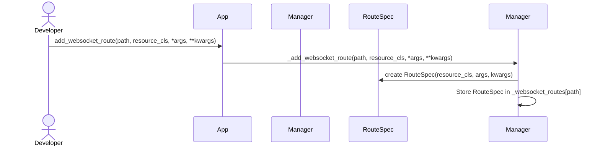
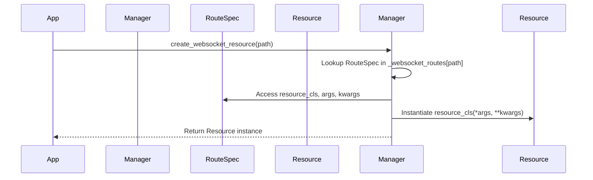
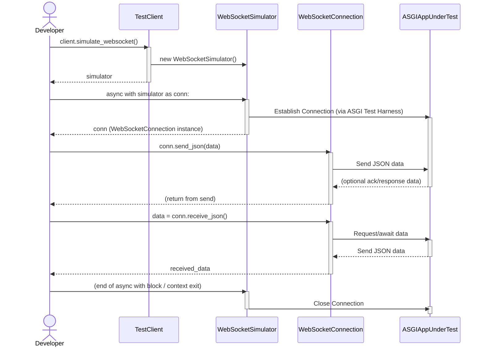

# Falcon-Pachinko: A Design Proposal for Asynchronous WebSocket Routing and Handling in the Falcon Web Framework <!-- markdownlint-disable-line MD013 -->

## 1. Introduction

The Falcon Web Framework is recognized for its performance, reliability, and
minimalist design, making it a popular choice for building RESTful APIs and web
application backends in Python.1 While Falcon provides foundational support for
WebSocket connections through its ASGI (Asynchronous Server Gateway Interface)
integration 2, it currently lacks a higher-level abstraction for routing and
handling WebSocket messages in a manner analogous to its well-regarded HTTP
routing and request handling mechanisms. This limitation often requires
developers to implement custom dispatch logic within a single WebSocket handler,
which can become complex for applications with rich real-time interaction.

This report presents a design proposal for an extension library, tentatively
named "Falcon-Pachinko," aimed at addressing this gap. The proposed library will
provide a structured and Falcon-idiomatic approach to routing WebSocket messages
based on their content (e.g., a 'type' field in a JSON payload) and managing
WebSocket connections. Furthermore, it will include a mechanism for associating
background workers (such as pollers or publish/subscribe event handlers) with
active WebSocket connections to facilitate server-initiated updates to clients.

The design prioritizes leveraging Falcon's existing capabilities and adhering to
its core principles, particularly the principle of least surprise for developers
already familiar with Falcon's HTTP paradigm. The AsyncAPI document, as
specified in the use case, will be treated as a design artifact informing the
structure of messages and interactions, rather than being directly consumed by
the library at runtime. This document will first survey existing solutions and
identify the specific needs addressed by the proposed extension. It will then
detail the core components and API of Falcon-Pachinko, followed by an
illustrative use case. Finally, potential future enhancements and conclusions
will be discussed.

## 2. Literature Survey and Existing Solutions

Before detailing the proposed design, it is pertinent to survey existing
WebSocket handling mechanisms within Falcon and other relevant Python web
frameworks and libraries. This provides context and helps identify established
patterns and potential areas for improvement.

### 2.1. Falcon's Native WebSocket Capabilities

Falcon's support for WebSockets is built upon the ASGI WebSocket Specification
and is available in its ASGI applications.2 Developers can add WebSocket support
to a route by implementing an `async def on_websocket(self, req, websocket)`
responder method within a resource class.1 This method is invoked when a
WebSocket handshake request is successfully routed.

The `falcon.asgi.WebSocket` object provided to this responder offers methods for
managing the connection lifecycle, such as `accept()`, `close()`,
`receive_text()`, `receive_data()`, `send_text()`, and `send_data()`.2 Falcon
also handles events like lost connections by raising a `WebSocketDisconnected`
exception. Middleware components and media handlers can be used to augment
WebSocket flows, similar to regular HTTP requests.2

However, Falcon's native support routes an entire WebSocket connection to a
single `on_websocket` handler. For applications requiring dispatch based on
incoming message types (e.g., in a chat application with different commands like
'send_message', 'user_typing', etc.), developers must implement this logic
manually within the `on_websocket` method. This can lead to large, complex
conditional structures that are difficult to maintain and test.

### 2.2. Starlette

Starlette, a lightweight ASGI framework, provides robust WebSocket support. It
uses `WebSocketRoute` for defining WebSocket endpoints, which can be an `async`
function or an ASGI class like `WebSocketEndpoint`.3 The `WebSocketEndpoint`
class typically offers methods like `on_connect`, `on_receive`, and
`on_disconnect` to handle different phases of the WebSocket lifecycle, although
the specifics of `WebSocketEndpoint` are not fully detailed in the reviewed
material.3 The `starlette.websockets.WebSocket` class itself provides
comprehensive methods for interaction, including `accept()`, `close()`, various
`send_*` and `receive_*` methods (for text, bytes, JSON), and iterators for
messages.4 Starlette's routing is path-based; message content-based dispatch
within an endpoint remains a manual task for the developer.

### 2.3. Django Channels

Django Channels extends Django to handle WebSockets and other protocols beyond
HTTP, built on ASGI.5 It introduces concepts like `Consumers` (analogous to
Django views but for WebSockets and other protocols) which handle the lifecycle
of a connection (e.g., `connect`, `disconnect`, `receive`).7 Routing is managed
by `ProtocolTypeRouter` (to distinguish between HTTP, WebSocket, etc.) and
`URLRouter` (for path-based routing to consumers).5 A key feature of Channels is
the "channel layer," an abstraction for inter-process communication (often
backed by Redis), allowing different parts of an application, including
background tasks, to send messages to WebSockets.5 While powerful, Django
Channels is a comprehensive system deeply integrated with Django, representing a
more heavyweight solution than what is typically sought for a Falcon extension.

### 2.4. FastAPI

FastAPI, built on Starlette, leverages Starlette's WebSocket capabilities.8 It
provides a decorator, `@app.websocket("/ws")`, to define WebSocket endpoints.8
Similar to Falcon and Starlette's basic function endpoints, this decorator
typically maps a path to a single asynchronous function that manages the entire
WebSocket connection lifecycle, including accepting the connection, receiving
messages in a loop, and sending responses.8 Message dispatch based on content
within this function is a manual implementation detail.

### 2.5. `websockets` Library

The `websockets` library is a focused Python library for building WebSocket
servers and clients, emphasizing correctness, simplicity, and performance.10 It
is built on `asyncio` and provides a coroutine-based API. While excellent for
implementing the WebSocket protocol itself (e.g., `serve` for servers, `connect`
for clients), it is not a web framework extension and does not offer
higher-level routing or integration with framework components like Falcon's
resources or request objects.10 Its primary goal is protocol implementation
rather than framework-level application structure.

### 2.6. Gap Analysis and Opportunity

The survey reveals that while Falcon has basic ASGI WebSocket support, it lacks
a dedicated mechanism for structured message routing and handling within a
WebSocket connection that is analogous to its HTTP request handling. Frameworks
like Django Channels offer very comprehensive solutions but come with
significant architectural overhead. Starlette and FastAPI provide clean
WebSocket endpoint definitions but still require manual message dispatch logic
within those endpoints.

This identifies a clear opportunity for a Falcon extension that:

1. Provides a routing mechanism for incoming WebSocket messages based on their
   content (e.g., a 'type' field).
2. Offers a class-based structure for WebSocket handlers, similar to Falcon's
   HTTP resources, promoting organization and reusability.
3. Integrates a system for managing active connections to allow background
   workers to easily send messages to specific clients or groups of clients.
4. Achieves this in a lightweight, Falcon-idiomatic manner, consistent with the
   framework's philosophy of minimalism and developer experience.

The proposed Falcon-Pachinko library aims to fill this gap.

## 3. Proposed Design for Falcon WebSocket Extension ("Falcon-Pachinko")

The design of the Falcon-Pachinko extension is guided by the core principles of
leveraging Falcon's existing strengths, maintaining consistency with its HTTP
API, adhering to the principle of least surprise for Falcon developers, and
ensuring the extension remains lightweight.

### 3.1. Core Principles

- **Leverage Falcon's ASGI Foundation**: The extension will build upon Falcon's
  existing `falcon.asgi.App` and `falcon.asgi.WebSocket` components 1, ensuring
  seamless integration with the ASGI ecosystem.
- **Consistency with Falcon HTTP API**: The patterns for defining routes and
  resource handlers for WebSockets will closely mirror those used for HTTP,
  making the extension intuitive for existing Falcon users.
- **Principle of Least Surprise**: Developers familiar with Falcon should find
  the concepts and API of Falcon-Pachinko familiar and predictable.
- **Lightweight and Minimal Dependencies**: The core extension should introduce
  minimal overhead and dependencies, focusing on in-process functionality for
  common use cases.

### 3.2. Key Components

The extension will revolve around three primary components:

1. `WebSocketResource`: A base class that developers will inherit from to create
   WebSocket handlers. This class will provide lifecycle methods and a mechanism
   for dispatching incoming messages to specific handler methods.
2. **Message Dispatcher**: Integrated within the `WebSocketResource`, this
   mechanism will route incoming messages (assumed to be structured, e.g., JSON
   with a 'type' field) to appropriate asynchronous methods within the resource.
3. `WebSocketConnectionManager`: A central object responsible for tracking
   active WebSocket connections and managing logical groups or "rooms" of
   connections. This manager will be the primary interface for background
   workers to send messages to clients.

### 3.3. Application Integration

To enable the extension and its shared components, a simple setup step will be
required, typically during application initialization:

```python
import falcon.asgi
import falcon_pachinko  # The proposed extension library

app = falcon.asgi.App()
falcon_pachinko.install(app) # This would initialize and attach app.ws_connection_manager <!-- markdownlint-disable-line MD013 -->
```

This `install` function would instantiate the `WebSocketConnectionManager` and
make it accessible via the application instance (e.g.,
`app.ws_connection_manager`), allowing other parts of the application, including
background workers, to access it.

### 3.4. Routing WebSocket Connections

Analogous to Falcon's HTTP routing (`app.add_route()`), the extension will
provide a method to associate a URL path with a `WebSocketResource`:

```python
app.add_websocket_route(
    '/ws/chat/{room_name}',
    ChatRoomResource,
    history_size=100,
)
```

When a WebSocket upgrade request matches this path, Falcon-Pachinko will
instantiate `ChatRoomResource` with the provided arguments and manage the
connection lifecycle. Path parameters like `{room_name}` are supplied to the
resource's `on_*` methods, while options such as `history_size` are applied
during construction.



#### 3.4.1. Programmatic Resource Instantiation

Application code can also create a resource instance directly using
`app.create_websocket_resource(path)`. This helper returns a new object of the
class registered for `path` or raises `ValueError` if no such route exists.

```python
chat_resource = app.create_websocket_resource('/ws/chat/{room_name}')
```

Each call yields a fresh instance so that connection-specific state can be
maintained independently.



### 3.5. The `WebSocketResource` Class

The `WebSocketResource` class is central to handling WebSocket interactions.
Developers will subclass it to implement their application-specific WebSocket
logic.

- **Lifecycle Methods**:

  - `async def on_connect(self, req, ws, **params) -> bool`: WebSocket
    connection is established and routed to this resource. `req` is the standard
    Falcon `Request` object associated with the initial HTTP upgrade request,
    and `ws` is a **`WebSocketLike` connection**. The protocol defines the
    minimal `send`, `accept`, and `close` methods needed by the resource.
    `params` will contain any
    path parameters from the route. The method should return `True` to accept
    the connection or `False` to reject it. If `False` is returned, the library
    will handle sending an appropriate closing handshake (e.g., HTTP 403 or a
    custom code if supported by an extension like WebSocket Denial Response 12).
    This boolean return abstracts the direct `await ws.accept()` or
    `await ws.close()` call, simplifying the resource method to focus on
    connection logic rather than raw ASGI mechanics. This design aligns with
    Falcon's higher-level approach for HTTP handlers, where the framework
    manages response sending.

  - `async def on_disconnect(self, ws: WebSocketLike, close_code: int)`:
    Called when the WebSocket connection is closed, either by the client or the
    server. `close_code` provides the WebSocket close code.

  - `async def on_message(self, ws: WebSocketLike, message: Union[str, bytes])`:
        <!-- markdownlint-disable-line MD013 --> A fallback handler for messages
    that are not dispatched by the more specific message handlers (see below).
    This can be used for raw text/binary data or messages that don't conform to
    the expected structured format.

- State Management:

  Unlike Falcon's default HTTP resource instantiation (often per-request), an
  instance of a WebSocketResource will typically be created per WebSocket
  connection. This allows the resource instance to hold connection-specific
  state throughout the lifetime of the WebSocket.

### 3.6. Message Handling and Dispatch

A key feature of Falcon-Pachinko is its ability to dispatch incoming WebSocket
messages to specific handler methods within the `WebSocketResource`. This avoids
a monolithic `on_receive` method with extensive conditional logic.

- **Message Format Assumption**: The primary dispatch mechanism assumes messages
  are JSON objects containing a 'type' field, for example:
  `{"type": "user_typing", "payload": {"isTyping": true}}`.

- **Decorator-Based Dispatch**: A decorator will be provided to mark methods as
  handlers for specific message types:

  ```python
  from falcon_pachinko import WebSocketLike, WebSocketResource, handles_message
  import msgspec

  class NewChatMessage(msgspec.Struct):
      text: str

  class StatusUpdate(msgspec.Struct):
      room: str

  class ChatMessageHandler(WebSocketResource):
      @handles_message("new_chat_message")
      async def handle_new_chat_message(
          self, ws: WebSocketLike, payload: NewChatMessage
      ) -> None:
          text = payload.text
          print(f"NEW MESSAGE: {text}")

      @handles_message("user_status_update")
      async def handle_status_update(
          self, ws: WebSocketLike, payload: StatusUpdate
      ) -> None:
          print(f"JOINED ROOM: {payload.room}")

  ```

  When a JSON message is received, the library will automatically deserialize
  it. If a 'type' field is present and matches a registered handler, that
  handler method will be invoked with the WebSocket object and the deserialized
  payload. This structured approach encourages cleaner client-side WebSocket
  message design and leads to more maintainable server-side code, much like how
  distinct HTTP methods and paths organize REST API interactions.

- **Automatic Deserialization**: For messages routed via `@handles_message`, the
  library will attempt to parse the message as JSON and extract the payload. If
  parsing fails or the 'type' field is missing, the generic `on_message` handler
  could be invoked if defined.

- **Typed Payloads**: Any payload argument to a resource method is converted
  into a `msgspec.Struct` instance for type safety and fast serialization.

#### Descriptor Implementation of `handles_message`

The decorator is implemented as a descriptor so that handlers are registered
when their containing class is created:

```python
import functools
from typing import Callable, Dict, Any


class _MessageHandlerDescriptor:
    """Store the original function and remember its owner class."""

    def __init__(self, msg_type: str, func: Callable) -> None:
        self.msg_type = msg_type
        self.func = func
        functools.update_wrapper(self, func)
        self.owner = None
        self.name = None

    def __set_name__(self, owner: type, name: str) -> None:
        self.owner = owner
        self.name = name

        registry: Dict[str, Callable] = getattr(owner, "_message_handlers", {})
        if self.msg_type in registry:
            raise RuntimeError(
                f"Duplicate handler for message type {self.msg_type!r} on {owner.__qualname__}"
            )
        registry[self.msg_type] = self.func
        owner._message_handlers = registry

    def __get__(self, instance: Any, owner: type | None = None) -> Callable:
        return self.func.__get__(instance, owner or self.owner)


def handles_message(msg_type: str) -> Callable[[Callable], _MessageHandlerDescriptor]:
    """Decorator factory returning the descriptor wrapper."""

    def decorator(func: Callable) -> _MessageHandlerDescriptor:
        return _MessageHandlerDescriptor(msg_type, func)

    return decorator
```

### 3.7. `WebSocketConnectionManager`

The `WebSocketConnectionManager` is crucial for enabling server-initiated
messages and managing groups of connections. It will be an in-process manager by
default.

- **Purpose**:

  - Track all active WebSocket connections (identified by a unique ID, and
    associated with their `WebSocketResource` instance if needed).
  - Manage logical groups or "rooms" of connections (e.g., all users in a
    specific chat room).
  - Provide an API for background workers or other application components to
    broadcast messages to specific connections, groups, or all connections.

- **Proposed Methods**:

  - `add_connection(connection_id, websocket, resource_instance)`: Registers a
    new connection.
  - `remove_connection(connection_id: str)`: Removes a connection.
  - `join_room(connection_id: str, room_name: str)`: Associates a connection
    with a room.
  - `leave_room(connection_id: str, room_name: str)`: Disassociates a connection
    from a room.
  - `broadcast_to_room(room_name: str, message: Any, exclude_ids: Optional] = None)`:
        <!-- markdownlint-disable-line MD013 --> Sends a message (typically a dict
    to be JSON serialized) to all connections in a room.
  - `send_to_connection(connection_id: str, message: Any)`: Sends a message to a
    specific connection.
  - `get_connections_in_room(room_name: str) -> List`: Retrieves WebSocket
    objects for connections in a room.
  - `get_rooms_by_prefix(prefix: str) -> List[str]`: Retrieves room names
    matching a given prefix.

  The `WebSocketResource` base class could provide convenience methods like
  `self.join_room(room_name)`, `self.leave_room(room_name)`, and
  `self.broadcast_to_room(room_name, message)` that internally use the
  connection manager associated with the application. This provision of built-in
  "room" management significantly lowers the barrier to entry for common
  multi-user application patterns, such as chat applications, abstracting away
  boilerplate logic that developers would otherwise need to implement
  repeatedly.

- Implementation Strategy:

  Initially, this manager will be an in-process Python object (e.g., using
  dictionaries and sets to store connection and room information). This approach
  aligns with Falcon's lightweight philosophy for common use cases such as
  single-instance deployments or deployments behind a load balancer with sticky
  sessions. It provides a simpler alternative to the more complex, potentially
  external, channel layers seen in frameworks like Django Channels 5, fulfilling
  the core requirement for background worker communication without imposing
  additional infrastructure dependencies for basic scenarios.

### 3.8. Background Worker Integration

The extension will facilitate the integration of background tasks (e.g.,
pollers, pub/sub consumers) that need to send data to connected WebSocket
clients.

- **Worker Definition**: Workers will typically be asynchronous functions or
  methods.

- **Accessing the Manager**: These workers can access the
  `WebSocketConnectionManager` instance via `app.ws_connection_manager`.

- **Sending Messages**: Workers will use the manager's methods (e.g.,
  `broadcast_to_room`, `send_to_connection`) to dispatch messages.

- **Registration**: A mechanism to register and start these workers with the
  ASGI application lifecycle will be provided, for instance:

  ```python
  async def periodic_system_alerts(conn_manager: WebSocketConnectionManager):
      while True:
          await asyncio.sleep(60)
          alert_message = {"type": "system_alert", "payload": "Server maintenance soon."} <!-- markdownlint-disable-line MD013 -->
          # Example: Get all rooms starting with 'user_' and broadcast
          user_rooms = await conn_manager.get_rooms_by_prefix("user_")
          for room in user_rooms:
               await conn_manager.broadcast_to_room(room, alert_message)

  # During application setup:
  # app.add_websocket_worker(periodic_system_alerts, app.ws_connection_manager)
  # This would likely use asyncio.create_task to run the worker concurrently.

  ```

### 3.9. API Overview

The following table summarizes the key components of the proposed
Falcon-Pachinko API and their analogies to Falcon's HTTP mechanisms, where
applicable. This serves as a quick reference to understand the main abstractions
and their intended use.

<!-- markdownlint-disable MD013 -->

| Component/Concept                | Key Classes/Decorators/Methods                                                                                              | Purpose                                                                                                       | Analogy to Falcon HTTP (if applicable)                                                                                              |
| -------------------------------- | --------------------------------------------------------------------------------------------------------------------------- | ------------------------------------------------------------------------------------------------------------- | ----------------------------------------------------------------------------------------------------------------------------------- |
| Application Setup                | `falcon_pachinko.install(app)`                                                                                              | Initializes shared WebSocket components (e.g., connection manager) on the app.                                | App-level configuration/extensions.                                                                                                 |
| Route Definition                 | `app.add_websocket_route(path, resource_class, *args, **kwargs)`                                                                    | Maps a URI path to a `WebSocketResource` with optional initialization parameters.                                                                     | `app.add_route(path, resource_instance)`                                                                                            |
| Resource Instantiation           | `app.create_websocket_resource(path)`                                                                                       | Returns a new resource instance for the given path.                                                           | N/A                                                                                                                                 |
| Resource Class                   | `falcon_pachinko.WebSocketResource`                                                                                         | Base class for handling WebSocket connections and messages for a given route.                                 | Falcon HTTP Resource class (e.g., methods like `on_get`, `on_post` handle specific `falcon.HTTP_METHODS`).                          |
| Connection Lifecycle             | `async def on_connect(req, ws, **params) -> bool`, `async def on_disconnect(ws, close_code)`                                | Methods in `WebSocketResource` to manage connection setup and teardown.                                       | `process_request` / `process_response` middleware (for setup/teardown aspects), though more directly tied to the connection itself. |
| Message Handling (Typed)         | `@falcon_pachinko.handles_message("type_name") async def handler(self, ws, payload)`                                        | Decorator in `WebSocketResource` to route incoming JSON messages based on a `type` field to specific methods. | HTTP method responders like `on_get(req, resp, **params)`, `on_post(req, resp, **params)`.                                          |
| Message Handling (Generic)       | `async def on_message(self, ws, message)`                                                                                   | Fallback method in `WebSocketResource` for unhandled or non-JSON messages.                                    | N/A (Falcon HTTP relies on specific method responders).                                                                             |
| Connection Management (Resource) | `self.join_room(room_name)`, `self.leave_room(room_name)`, `self.broadcast_to_room(room_name, message, exclude_self=False)` | Convenience methods within `WebSocketResource` to interact with rooms/groups via the connection manager.      | N/A (HTTP is stateless).                                                                                                            |
| Background Worker Integration    | `app.add_websocket_worker(worker_coro, conn_manager)`                                                                       | Registers an asynchronous task that can send messages to clients via the connection manager.                  | Background task patterns (often custom in Falcon HTTP).                                                                             |
| Connection Management (Global)   | `app.ws_connection_manager` (instance of `WebSocketConnectionManager`)                                                      | Central object to track connections, manage groups, and enable broadcasting from any part of the app.         | N/A (HTTP is stateless).                                                                                                            |
| Manager Methods (Global)         | `conn_manager.broadcast_to_room(room, msg)`, `conn_manager.send_to_connection(id, msg)`, etc.                               | Methods on the connection manager for sending messages from workers or other application components.          | N/A                                                                                                                                 |

<!-- markdownlint-enable MD013 -->

This API structure is designed to be both powerful enough for complex
applications and intuitive for developers accustomed to Falcon.

## 4. Illustrative Usecase: Real-time Chat Application

To demonstrate the practical application and ergonomics of the proposed
Falcon-Pachinko extension, this section outlines its use in building a real-time
chat application.

### 4.1. Scenario Overview

The chat application will support multiple chat rooms. Users can connect to a
specific room via a WebSocket URL (e.g., `/ws/chat/{room_name}`). Once
connected, they can send messages, and these messages will be broadcast to all
other users in the same room. The application will also support presence
indications (users joining/leaving) and typing indicators.

An AsyncAPI document (used as a design artifact) would define the message
structures. For example:

- Client to Server:
  - `{"type": "clientSendMessage", "payload": {"text": "Hello everyone!"}}`
  - `{"type": "clientStartTyping"}`
  - `{"type": "clientStopTyping"}`
- Server to Client:
  - `{"type": "serverNewMessage", "payload": {"user": "Alice", "text": "Hello everyone!"}}`
        <!-- markdownlint-disable-line MD013 -->
  - `{"type": "serverUserJoined", "payload": {"user": "Bob"}}`
  - `{"type": "serverUserLeft", "payload": {"user": "Alice"}}`
  - `{"type": "serverUserTyping", "payload": {"user": "Charlie", "isTyping": true}}`
        <!-- markdownlint-disable-line MD013 -->

### 4.2. Defining the Chat WebSocket Resource

A `ChatRoomResource` class would be defined, inheriting from
`falcon_pachinko.WebSocketResource`:

```python
import falcon.asgi
from falcon_pachinko import WebSocketLike, WebSocketResource, handles_message

class ChatRoomResource(WebSocketResource):
    async def on_connect(self, req: falcon.Request, ws: WebSocketLike, room_name: str) -> bool: <!-- markdownlint-disable-line MD013 -->
        # Assume authentication middleware has set req.context.user
        self.user = req.context.get("user")
        if not self.user:
            # Optionally send a specific denial message before returning False
            # await ws.send_text("Authentication required.") # Requires careful handling of ws state if library auto-closes <!-- markdownlint-disable-line MD013 -->
            return False # Reject connection

        self.room_name = room_name
        self.connection_id = ws.subprotocol # Or generate a unique ID
        
        await self.join_room(self.room_name) # Uses connection manager via base class <!-- markdownlint-disable-line MD013 -->

        await ws.send_media({
            "type": "serverSystemMessage",
            "payload": {"text": f"Welcome {self.user.name} to room '{room_name}'!"} <!-- markdownlint-disable-line MD013 -->
        })

        await self.broadcast_to_room(
            self.room_name,
            {"type": "serverUserJoined", "payload": {"user": self.user.name}},
            exclude_self=True
        )
        return True

    @handles_message("clientSendMessage")
    async def handle_client_send_message(self, ws: WebSocketLike, payload: dict): <!-- markdownlint-disable-line MD013 -->
        message_text = payload.get("text", "")
        # Add validation/sanitization as needed
        await self.broadcast_to_room(
            self.room_name,
            {"type": "serverNewMessage", "payload": {"user": self.user.name, "text": message_text}} <!-- markdownlint-disable-line MD013 -->
        )

    @handles_message("clientStartTyping")
    async def handle_client_start_typing(self, ws: WebSocketLike, payload: dict): <!-- markdownlint-disable-line MD013 -->
        await self.broadcast_to_room(
            self.room_name,
            {"type": "serverUserTyping", "payload": {"user": self.user.name, "isTyping": True}}, <!-- markdownlint-disable-line MD013 -->
            exclude_self=True
        )

    @handles_message("clientStopTyping")
    async def handle_client_stop_typing(self, ws: WebSocketLike, payload: dict): <!-- markdownlint-disable-line MD013 -->
        await self.broadcast_to_room(
            self.room_name,
            {"type": "serverUserTyping", "payload": {"user": self.user.name, "isTyping": False}}, <!-- markdownlint-disable-line MD013 -->
            exclude_self=True
        )

    async def on_disconnect(self, ws: WebSocketLike, close_code: int):
        if hasattr(self, 'room_name') and hasattr(self, 'user'): # Ensure on_connect completed successfully <!-- markdownlint-disable-line MD013 -->
            await self.broadcast_to_room(
                self.room_name,
                {"type": "serverUserLeft", "payload": {"user": self.user.name}},
                exclude_self=True # Technically not needed if connection is already gone from room <!-- markdownlint-disable-line MD013 -->
            )
            await self.leave_room(self.room_name) # Uses connection manager
        print(f"User {getattr(self.user, 'name', 'Unknown')} disconnected from room {getattr(self, 'room_name', 'N/A')} with code {close_code}") <!-- markdownlint-disable-line MD013 -->

    async def on_message(self, ws: WebSocketLike, message: Union[str, bytes]): <!-- markdownlint-disable-line MD013 -->
        # Fallback for messages not matching handled types or non-JSON
        print(f"Received unhandled message from {self.user.name} in {self.room_name}: {message}") <!-- markdownlint-disable-line MD013 -->
        await ws.send_media({
            "type": "serverError",
            "payload": {"error": "Unrecognized message format or type."}
        })

```

This example demonstrates how the `WebSocketResource` and the `@handles_message`
decorator streamline the development of a feature-rich chat application. The
abstractions for room management (`self.join_room`, `self.broadcast_to_room`)
and typed message handling significantly reduce boilerplate code. Applying the
design to such a concrete use case effectively tests the ergonomics of the
proposed API, confirming that its abstractions are intuitive and contribute to
cleaner, more maintainable code.

Furthermore, this use case highlights how server-side handler names or decorator
arguments (e.g., `"clientSendMessage"`) can directly correspond to message types
defined in an external design artifact like an AsyncAPI document. This
alignment, even without direct runtime consumption of the AsyncAPI
specification, promotes better API discipline and makes the codebase easier to
understand and maintain in conjunction with its formal definition.

### 4.3. Routing and Application Setup

In the main application file:

```python
import falcon.asgi
import falcon_pachinko  # The proposed extension
import asyncio

# Assuming ChatRoomResource is defined as above
# Assuming an authentication middleware `AuthMiddleware` that sets `req.context.user` <!-- markdownlint-disable-line MD013 -->

app = falcon.asgi.App(middleware=[AuthMiddleware()])
falcon_pachinko.install(app) # Initializes app.ws_connection_manager

chat_resource = ChatRoomResource() # Instantiated once if it's stateless or per-connection by the lib <!-- markdownlint-disable-line MD013 -->
app.add_websocket_route('/ws/chat/{room_name}', chat_resource)
```

### 4.4. Background Worker for System Announcements (Example)

A background worker could periodically send system-wide announcements to all
active chat rooms:

```python
async def system_announcement_worker(conn_manager: falcon_pachinko.WebSocketConnectionManager) -> None: <!-- markdownlint-disable-line MD013 -->
    while True:
        await asyncio.sleep(3600) # Every hour
        announcement_text = "System maintenance is scheduled for 2 AM UTC. Brief disruptions may occur." <!-- markdownlint-disable-line MD013 -->
        
        # A method to get all rooms or rooms matching a pattern would be useful here. <!-- markdownlint-disable-line MD013 -->
        # For demonstration, assume conn_manager has a way to get all relevant room IDs. <!-- markdownlint-disable-line MD013 -->
        # This example assumes a method to get all rooms managed by the connection manager. <!-- markdownlint-disable-line MD013 -->
        # A more specific method like get_rooms_by_prefix("chat_") would be better. <!-- markdownlint-disable-line MD013 -->
        
        active_rooms = await conn_manager.get_all_managed_room_names() # Hypothetical method <!-- markdownlint-disable-line MD013 -->
        # Or, if rooms are not explicitly tracked this way, broadcast to all connections <!-- markdownlint-disable-line MD013 -->
        # with a filter on the client side or by iterating through connections and checking resource state. <!-- markdownlint-disable-line MD013 -->
        # For this example, let's assume we target rooms with a 'chat_' prefix.
        
        chat_room_ids = await conn_manager.get_rooms_by_prefix("chat_")

        for room_id in chat_room_ids:
            await conn_manager.broadcast_to_room(
                room_id,
                {"type": "serverSystemAnnouncement", "payload": {"text": announcement_text}} <!-- markdownlint-disable-line MD013 -->
            )
        print("Sent hourly system announcement.")

# In application setup, after falcon_pachinko.install(app):
# Ensure the event loop is running if this setup is outside an async context
# For Uvicorn, tasks can be added to app.router.lifespan_context
# A more robust way would be to use Falcon's lifespan events if available for ASGI tasks, <!-- markdownlint-disable-line MD013 -->
# or manage tasks explicitly.

# Simplified registration:
# app.add_websocket_worker(system_announcement_worker, app.ws_connection_manager) <!-- markdownlint-disable-line MD013 -->
# This would internally handle asyncio.create_task and task lifecycle.
```

This worker demonstrates how server-initiated messages can be sent independently
of any specific client request, leveraging the `WebSocketConnectionManager`.

### 4.5. Client-Side Interaction (Conceptual)

A JavaScript client would interact as follows:

1. **Connect**:
   `const socket = new WebSocket("ws://localhost:8000/ws/chat/general");`

2. **Send Messages**:

````javascript
   socket.send(JSON.stringify({type: "clientSendMessage", payload: {text: "Hi there!"}})); <!-- markdownlint-disable-line MD013 -->
   socket.send(JSON.stringify({type: "clientStartTyping"}));

3. **Receive Messages**:

```javascript
   socket.onmessage = function(event) {
       const message = JSON.parse(event.data);
       switch(message.type) {
           case "serverNewMessage":
               // Display message.payload.user and message.payload.text
               break;
           case "serverUserJoined":
               // Update user list with message.payload.user
               break;
           // Handle other message types...
       }
   };

```
````

This illustrative use case shows how Falcon-Pachinko can provide a comprehensive
and developer-friendly solution for building real-time applications on Falcon.

## 5. Future Considerations and Potential Enhancements

While the proposed design addresses the core requirements, several areas could
be explored for future enhancements to further increase the library's power and
flexibility.

### 5.1. Advanced Subprotocol Handling

The current design focuses on basic subprotocol acceptance via the
`falcon.asgi.WebSocket.accept(subprotocol=...)` method, which could be exposed
in `on_connect`. Future versions could explore more structured ways to handle
different subprotocols, perhaps allowing `WebSocketResource` subclasses to
specialize in particular subprotocols or offering mechanisms to select a handler
based on the negotiated subprotocol.

### 5.2. Compression Extensions

Investigating support for WebSocket compression extensions (RFC 7692, e.g.,
`permessage-deflate`) could improve bandwidth efficiency. Falcon's
`WebSocket.accept()` method does not currently list explicit parameters for
negotiating compression extensions.2 This would likely depend on the
capabilities of the underlying ASGI server (e.g., Uvicorn, Daphne) and might
require lower-level access to the ASGI connection scope or specific ASGI
extensions.

### 5.3. Enhanced Connection Grouping and Targeting

The `WebSocketConnectionManager` currently proposes room-based grouping. More
sophisticated targeting mechanisms could be added, such as:

- Targeting all connections belonging to a specific authenticated user ID
  (across multiple devices/tabs).
- Allowing connections to be tagged with arbitrary labels for flexible group
  definitions. This would likely involve a more complex internal structure for
  the `WebSocketConnectionManager`.

### 5.4. Scalability for Distributed Systems

The initial design of the WebSocketConnectionManager is for in-process
operation, suitable for single-server deployments or those using sticky
sessions. For applications requiring horizontal scaling across multiple server
instances, this in-process manager becomes a limitation, as broadcasts would
only reach clients connected to the same instance.

A significant enhancement would be to make the WebSocketConnectionManager
pluggable, allowing different backend implementations. For example:

- An implementation using a message bus like Redis Pub/Sub (similar to Django
  Channels' channel layer 5) would enable inter-process communication, allowing
  a message published on one instance to be delivered to WebSockets connected to
  other instances. Designing the `WebSocketConnectionManager` with a clear
  interface (e.g., an Abstract Base Class) from the outset would facilitate this
  evolution, allowing the library to start simple but provide a clear upgrade
  path for distributed deployments without requiring a fundamental rewrite of
  the application logic that interacts with the manager.

### 5.5. Testing Utilities

To aid developers in creating robust WebSocket applications, dedicated testing
utilities would be highly beneficial. These could be similar to Falcon's
`falcon.testing` module for HTTP or Django Channels' `WebsocketCommunicator`.5
Such utilities would allow developers to:

- Simulate a WebSocket client connecting to a `WebSocketResource`.
- Send messages to the server and assert responses.
- Receive messages broadcast by the server or background workers.
- Test connection lifecycle events (`on_connect`, `on_disconnect`). The
  provision of comprehensive testing tools is critical for library adoption and
  for enabling developers to build reliable real-time systems, which can
  otherwise be complex to test. Proactively considering these utilities enhances
  the library's completeness and professional appeal.

An initial API could include a `WebSocketSimulator` class that mimics a client
connection using Falcon's ASGI test harness. The simulator would operate as an
asynchronous context manager, returning a connection object with helpers like
`send_json()` and `receive_json()`. A convenience method,
`simulate_websocket()`, on the standard test client would construct this
simulator. Additionally, pytest fixtures should expose a ready-to-use simulator
and manage background worker startup, so tests can focus on asserting behaviour.



### 5.6. Automatic AsyncAPI Documentation Generation (Ambitious)

As a long-term vision, the structured nature of `WebSocketResource` and the
`@handles_message` decorators could potentially be leveraged to automatically
generate a stub or a basic AsyncAPI document. This would further bridge the gap
between design artifacts and implementation, though it represents a
significantly more complex undertaking.

## 6. Conclusion

This report has outlined a design proposal for Falcon-Pachinko, an extension
library aimed at providing idiomatic, asynchronous WebSocket routing and
handling for the Falcon Web Framework. The proposed design introduces key
components such as the `WebSocketResource` for class-based message handling, a
decorator-based message dispatch system, and a `WebSocketConnectionManager` to
facilitate stateful connection management and background worker integration.

### 6.1. Summary of the Proposed Design

The core of the proposal revolves around:

- `app.add_websocket_route()`: For routing WebSocket connections to
  `WebSocketResource` instances in a manner analogous to Falcon's HTTP routing.
- `WebSocketResource`: A base class offering `on_connect`, `on_disconnect`, and
  `on_message` lifecycle methods, along with connection-specific state.
- `@handles_message("type")`: A decorator enabling methods within a
  `WebSocketResource` to handle specific types of incoming JSON messages,
  promoting organized and maintainable code.
- `WebSocketConnectionManager`: An in-process component for tracking
  connections, managing "rooms" or groups, and enabling background workers to
  broadcast messages to clients.

### 6.2. Benefits and Advantages

The Falcon-Pachinko extension, as designed, offers several benefits:

- **Falcon-Idiomatic Development**: It provides an interface consistent with
  Falcon's existing HTTP patterns, reducing the learning curve for Falcon
  developers.
- **Improved Organization and Maintainability**: By enabling structured message
  handling and class-based resources, it helps organize complex WebSocket logic
  more effectively than a single `on_websocket` handler.
- **Simplified Background Task Integration**: The `WebSocketConnectionManager`
  provides a straightforward way for background tasks to communicate with
  connected clients.
- **Adherence to Least Surprise**: The design aims to be intuitive and
  predictable for those familiar with Falcon. The design endeavors to strike a
  balance, introducing powerful new capabilities while respecting Falcon's
  characteristic minimalism and performance focus.1 The objective is for these
  features to feel like a natural and lean augmentation of the framework.

### 6.3. Meeting User Requirements

The proposed design directly addresses the key requirements of the initial
query:

- **Analogous Routing and Handling**: `app.add_websocket_route` and
  `WebSocketResource` with `@handles_message` provide a system analogous to
  Falcon's HTTP routing and `on_get`/`on_post` responders.
- **Background Worker Mechanism**: The `WebSocketConnectionManager` and
  `app.add_websocket_worker` (or similar registration) allow background tasks to
  send updates to clients.
- **Leveraging Falcon's Capabilities**: The design builds upon Falcon's ASGI
  support, `Request` object, and general architectural patterns.
- **Consistency and Least Surprise**: The API design mimics Falcon's HTTP
  counterparts where appropriate.
- **AsyncAPI as Design Artifact**: The message 'type' based dispatch aligns well
  with message definitions in an AsyncAPI document, facilitating its use as a
  design guide.

### 6.4. Final Thoughts

The Falcon-Pachinko extension has the potential to significantly enhance
Falcon's capabilities in the domain of real-time web applications. By providing
a robust yet lightweight solution for asynchronous WebSocket communication, it
can empower developers to build sophisticated interactive applications, such as
chat systems, live dashboards, and collaborative tools, with the same elegance
and performance they expect from Falcon for HTTP APIs.

The successful development and adoption of this library could broaden Falcon's
applicability, attracting developers who require first-class real-time features
within a high-performance Python framework. This, in turn, could foster a larger
and more diverse Falcon community and ecosystem, centered around both
traditional API development and emerging real-time use cases.
